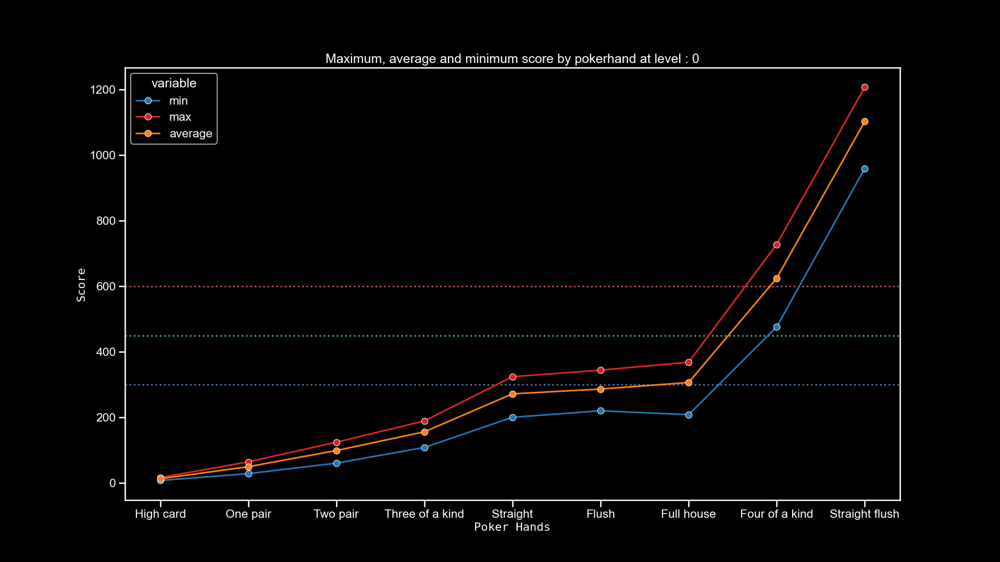
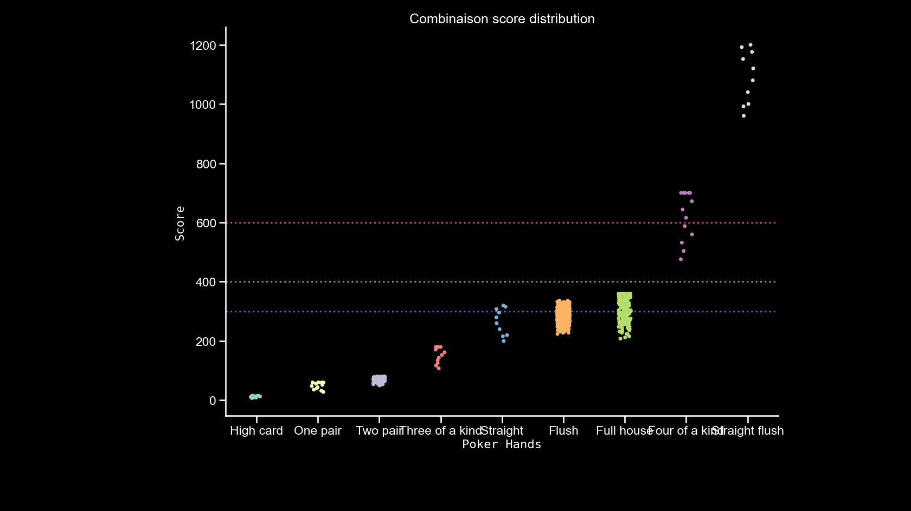
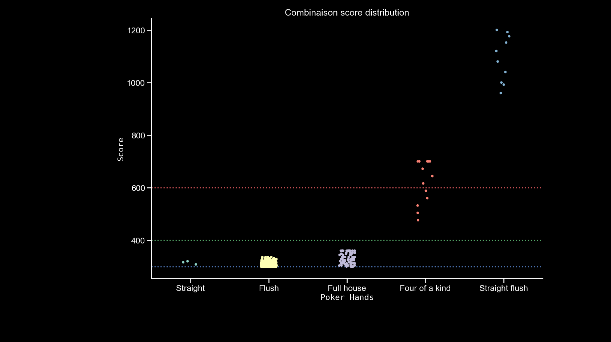
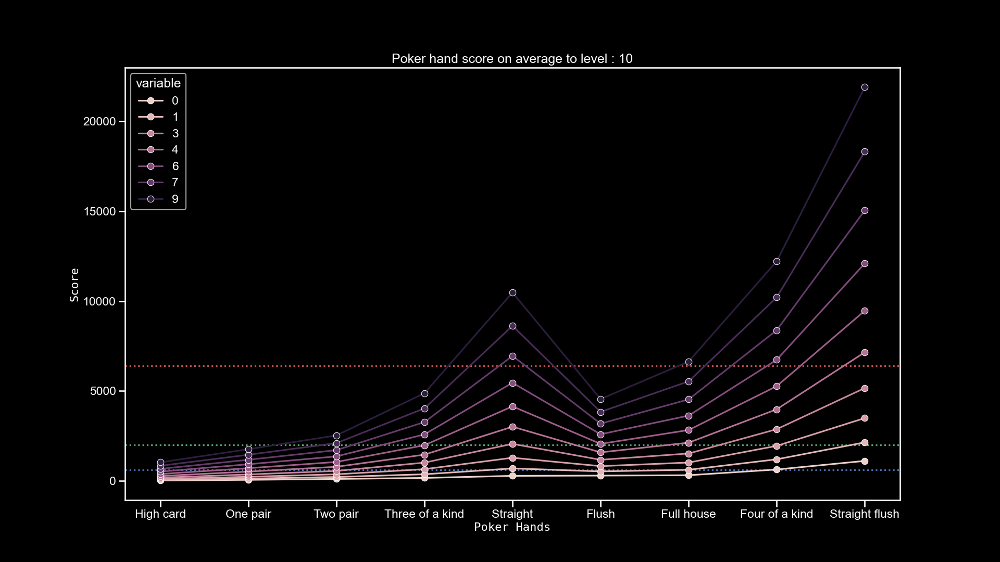
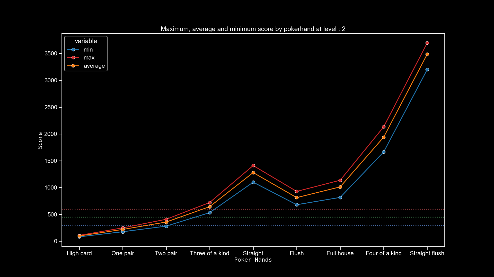
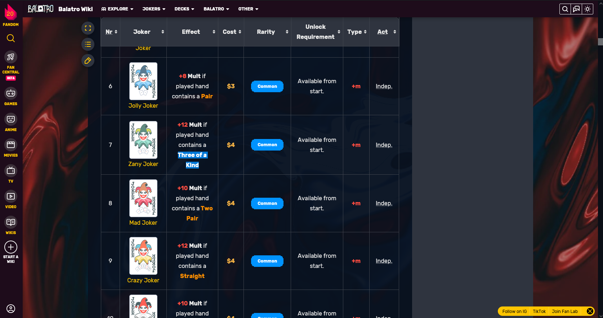

# Project

Title:
Straight in balatro suck and I will proove it - Dumy version where a each iteration I try to proove straight suck but no
Why I don't play straight in Balatro
Straight  in Balatro is overpowered, but I don't play it
Is Straight a good poker hand in Balatro?

# Data:
Figure size : 20 * 11.25 inches = 1920 *1080 pixel


# Intro
After hours of playing , unlocking all jokers, 4 decks at max stack and a lot of win and loose.
I can say it !
I never play Straight in Balatro. I feel it is weak and hard to scale.
In my monkey brain 5 card ordered is harder to get then 5 cards unordered of the same image. right?
But may be Im wrong? 
May be I suck at probabilities and can't see  the potential of Straight.
This is why I decide to go back to statistics books and re-learn basic probabilties stuff and data vizalisation and share it with you what I'have discover 
Is straight is finally a good option to play in Balatro?
All this games was I dumb and may be dumber? 
Even if straight is probably one of the most powerfull poker hand of the game.
*Fade it*

## 1. Balatro brief sumary
For the unlucky ones who don't know what balatro is let's have quick tour.
In one sentence : Balatro is a poker game but you can optimize your deck to improove your success rate.
You can play cards, and some combination of card are poker hand. It's exactly like in poker : pair: two card with identique symbole, straight : five card ordered with no gap, flush 5 cards of the same suit etc.
Each hand have a base chips and an base mult. When you play an hand the score of each card are add to the base chips and it's multiply by the base mult.
I say base chips and mult because this values can pe pimp it up the more you progress in the game with the help of jokers for example.
Basicaly what you have to know, the most difficult is the hand to realize the more points it give you.
Each level alias ante consits to beat or pass three blind.
For example the first " ante you have to beat three blind of respectively  : 300,450,600 points.
For each game you can choose an deck. Each deck have special effect.
But unlike in poker, you havez a number of discard and number of hand that you can play. Discard remove some cards of you hand  and you let you draw the same amount you discarded. Hands are your way to score points.
it's not too complicated to learn but a bit hard to master.
Last point : It exists difficulties level, respresenedt by the stack, there 9 level of difficulty wich each level a new malus effect is added to your game. It's like slay the spire or dead cells to named famous rogue like.

And boy, in this game the last level of difficulty is realy spicy. One mistake and you loose your game.

For my part player experience : I have unlock all jokers, hours of playing, and finish the gold leve difficulty on 4 deck. So i know some stuff. Perhaps.
May be. I don't know . Can you repeat the questio....

## 2. Why talking about Straight?
I forget to mention, there is a mechaninc in the game where aach unused hand are converted at the end of a winning round to dollars. For most of the deck is realy important, especially in the first rounds.


My goal is to beat the first three bli d with the less hand played. Because I need that money, especially for the death deck.
This deck is soooo unfriendly
The special power, we can say it useless most of the time. 
No really I don't like this deck. 

Anyway
So I need to beat the first blinds easely and in less hand.
I said  easely because we will see that some poker hand are too complicated to set up at the begining of the game.
Let's gather some data

```
+----+-----------------+--------------+-------------+-----------------+----------------+
|    | Poker Hand      |   Base chips |   Base mult |   LevelUp chips |   LevelUp mult |
|----+-----------------+--------------+-------------+-----------------+----------------|
|  0 | High card       |            5 |           1 |              10 |              1 |
|  1 | One pair        |           10 |           2 |              15 |              1 |
|  2 | Two pair        |           20 |           2 |              20 |              1 |
|  3 | Three of a kind |           30 |           3 |              20 |              2 |
|  4 | Straight        |           30 |           4 |              30 |              3 |
|  5 | Flush           |           35 |           4 |              15 |              2 |
|  6 | Full house      |           40 |           4 |              25 |              2 |
|  7 | Four of a kind  |           60 |           7 |              30 |              3 |
|  8 | Straight flush  |          100 |           8 |              40 |              4 |
+----+-----------------+--------------+-------------+-----------------+----------------+

```


Here are the base chips and mult for each hand and how much this values are modified by poker hand level.
What do we want?
We want to identify poker hands that I will beat the fisrt blind on one hand.
So what I want to know to see how much points can I get on average from a poker hand at level 0.

So here's the table that summerize that.

```
+----+-----------------+-------+-------+-----------+
|    | Poker Hand      |   min |   max |   average |
|----+-----------------+-------+-------+-----------|
|  0 | High card       |     7 |    16 |     12.31 |
|  1 | One pair        |    28 |    64 |     49.24 |
|  2 | Two pair        |    60 |   124 |     98.46 |
|  3 | Three of a kind |   108 |   189 |    155.76 |
|  4 | Straight        |   200 |   324 |    271.56 |
|  5 | Flush           |   220 |   344 |    286.16 |
|  6 | Full house      |   208 |   368 |    306.16 |
|  7 | Four of a kind  |   476 |   728 |    624.61 |
|  8 | Straight flush  |   960 |  1208 |   1103.12 |
+----+-----------------+-------+-------+-----------+
```
This table is cool, we can already see  which poker hand we have to turn our attention.
But you know what is cooler?
Visual representation for our monkey brain.

(In description on the video may be
I took all the possible combos for each hand, and calculate the  outcome if played.
For example:
Four of a king, the best combinaison are four aces so  11*4 + 60 * 7 = 728
And the worst one for four of kind is  2*4 + 60 * 7  = 476
)

Here's the visual representation of these datas as a lineplot


I traced 3 lines to represent the differents scores of the first blinds : 300,450,600

From this graph we can separete poker hand in two groups. 
The one that can beat the first blind in one hand
And the others:

So High card, one pair, two pair, three of a king are not good candidate when starting a new game. We will exclude them from our reflexion.

In fact I will be ce quick  only Straight, Flush, Full house interest me, because they are the one that can beat the first blind and they seem to be realisable.
Because if you're are aiming for four of a kind or straight flush, good luck.

Here's are the probabilities when you draw 5 card in a classic poker game .

You would expect draw a four hand 0.024 of the time.
This is 6 times less than full house
And 16 times less than a straight
```
+----+-----------------+-------------+---------------+---------+
|    | Poker Hand      |   Frequency |   Probability |   Combo |
|----+-----------------+-------------+---------------+---------|
|  0 | High card       |     1302540 |      50.1177  |      13 |
|  1 | One pair        |     1098240 |      42.2569  |      13 |
|  2 | Two pair        |      123552 |       4.7539  |      78 |
|  3 | Three of a kind |       54912 |       2.1128  |      13 |
|  4 | Straight        |       10200 |       0.3925  |      10 |
|  5 | Flush           |        5108 |       0.1965  |    1277 |
|  6 | Full house      |        3744 |       0.14441 |     156 |
|  7 | Four of a kind  |         624 |       0.02401 |      13 |
|  8 | Straight flush  |          36 |       0.00154 |      10 |
+----+-----------------+-------------+---------------+---------+
```

So so so 
The real choice is Straight versus Flush  versus full house.
But for me everythime I exclude straight becayse I feel it's hard to build up versus flush. But am I wrong?

## 3. Probabilities
Let's check if Straight is easier or hard to make than a  Flush.
On a deck of 52 cards with 13 different cards of 4  suits.
There is 10200 ways to make a straight versus 5108 for a flush.
```
+----+-----------------+-------------+---------------+---------+
|    | Poker Hand      |   Frequency |   Probability |   Combo |
|----+-----------------+-------------+---------------+---------|
|  0 | High card       |     1302540 |      50.1177  |      13 |
|  1 | One pair        |     1098240 |      42.2569  |      13 |
|  2 | Two pair        |      123552 |       4.7539  |      78 |
|  3 | Three of a kind |       54912 |       2.1128  |      13 |
|  4 | Straight        |       10200 |       0.3925  |      10 |
|  5 | Flush           |        5108 |       0.1965  |    1277 |
|  6 | Full house      |        3744 |       0.14441 |     156 |
|  7 | Four of a kind  |         624 |       0.02401 |      13 |
|  8 | Straight flush  |          36 |       0.00154 |      10 |
+----+-----------------+-------------+---------------+---------+
```

Ok but may be I need check something more specific.
Let's say I draw a 10 of spade. In this scenario what are the possible ways to build a flush or an straight?

For straight there is 
5 possible combinaison and for each card 4 value possible
{show the combinaison)}
(10,J,Q,K,A)
(9,10,J,Q,K)
(8,9,10,J,Q)
(7,8,9,10,J)
(,6,7,8,9,10)
It give us 
so 5 *1 *4 *4 * 4 *4  = 1280  possible way to build a straght.

For the flush .
There is 12 card left ( without the ten of spade) , and  you wantall the possible  unique combinaison for the last 4 card.
(12 in 4) n choose k
It gives you 495 way to do that.

There 2.5 times more possibility to build a straight from a ten thant for a flush

Ok but may be
I see one one last possibility




We do not have how much and wich combinaison can generate at least 300 points.
By the way we calculate how much points we need. 
For straght the equation is
300  = 30x * 4
300 = 120 + 4x
180 = 4x
180/4 =x
45 = x
So at least we need an hand with 45 card points to pass the first blind.
For flush
300  = 35x * 4
300 -140 = 4x
160 = 4x
40 = x
And 40 for flush

So how much card combinaison allow us to make this points and how much ways there is to make them.


Let's this if we can visualize it.




It'es great we can see the score distribution for each combinaison of each hand
But there too much uncessary informations let's focus on combinaison with a score superior to 300




On this graph I have draw all the combinaison possible that generate more than 300 points.

and here's the table

```
Poker Hand
Flush             341
Full house         91
Four of a kind     13
Straight flush     10
Straight            3

```
Ha ha may be we have something, there is much leeeeeess possible combinaison for Straight than Flush

The three straight combinaison are : 
(10,J,Q,K,A)
(9,10,J,Q,K)
(8,9,10,J,Q)

Let's calculate all the possbie way to make them.
Again for each card there if 4 possible suit.
So 
3*4*4*4*4*4 = 3072 possible way to a straight than beat the first blind

for flush:
341 possible combinaison times number of suit..


341 * 4 = 1 364


Again 2.25 times less ...


So in probabilities Straight beat flush with no context.

Ok, ok, but may be balatro mechanics disavantage straight over flush

## 4. Poker hand level
Ok at the last update Straight recieve a big boost. Straight level up bring  30 chips and 3 mult versus 15 and 2 for FLush.
The difference is really big
Let's see on first poker hands levels the differences

play meme sound stomp



Damn boy. You see the big spike ine the middle, it's still Straight
In term of scaling Straight stomp flush, full house and even compete with four of a kind


Wee can see with only one level, straight can beat the first boss on average versus flush who need two level on average.





Again Straight overshadow flush really easely

To defat the third boss it it's not a wall blind. I would need straight level 7 without any joker.
Flush even  with 9 level could not and full house need his level 9 to defeat the third boss
I start to running out of idea to demonstrate that straight is weak in balatro
One last try I promise

Jokers ! 

### 4.1. The last chance : jokers

Go on the wiki web page
We can get all the jokers with the specific poker hand key word in their description.



it give us this table.
Again straight get almost two times most dedicated jokers than flush. But the real winners of jokers is flush house because jokers with;
pair, two pair, three of a kind work with it. It give use 9 jokers.
```
+-----------------+-------------------+
| Poker Hand      |   Specific Jokers |
|-----------------+-------------------|
| High card       |                 0 |
| Pair            |                 3 |
| Two pair        |                 3 |
| Three of a kind |                 3 |
| Straight        |                 7 |
| Flush           |                 4 |
| Full house      |                 0 |
| Foud of a kind  |                 1 |
| Straight flush  |                 1 |
+-----------------+-------------------+
```

## 5. Conclusion 
Straight if good, really good, it overclass flush on all domain
(add picture of porbabilities, poker hand levels and jokers)
I see only one negative points for straight.
When I go for straight I feel trap in one way. I can't play other hand. Contrary as full house  can change later to four of a kind or five of a kind. And if for some reason I need to play an poker hand inferior I Can. With straight there is only on way.  Except that,  straight is good what ever was my feeling on it.
I should give a try for my next games
Well the voyage was nice :)
All resources and the script of this video are on the github repo you can found in description.
Some resources will be added later because there some area I want to explore in balatro, may be for another video
Thanks for watching, have fun and see you soon

## 6. Misc
All I didn't talk in the video 
### 6.1. Four fingers and shortcut, decuple the possibilities
With Four Fngers possible hand are
11 * 4*4*4*4* 13 = 36 608

Shortcut


### 6.2. Adding a card, upscall all probabilities 
I don't think it bring any knowledge, when I add a card it upscale all probaiblities
Make an example when I add one ten  how mush straight probability it upscale
and full house.

53 card with 5 10
10 choices
5 * 4puissance 5 = 5120
and 
5 * 4puissance4 * 5 = 6400

10200
11520
1320 way possible


Three of a king
12 4/3 1 5/3

()12 * 4  + 1 * 10) * 66 *4  == 61921

54912


### 6.3. From the balatro probabilties deduce the correlation  between poker hand score and probability

Is it a linear correlation, quadratic etc...


2.1. From a file containing all possibles values
```
[2,3,4,5,6,7,8,9,10,10,10,10,11]
```

Generate all average stats for each hand

```
   min  max  average       Poker hand
0    2   11     7.31        High card
1    4   22    14.62         One pair
2   10   42    29.23         Two pair
3    6   33    21.92  Three of a kind
4   20   51    37.89         Straight
5   20   51    36.54            Flush
6   12   52    36.54       Full house
7    8   44    29.23   Four of a kind
8   20   51    37.89   Straight flush
```

Generate a table where:
min_min _poker hand min_max

```
min min
   min  max  average Poker hand
0    2   11     7.31  High card
min max
   min  max  average      Poker hand
4   20   51    37.89        Straight
5   20   51    36.54           Flush
8   20   51    37.89  Straight flush
max min
   min  max  average Poker hand
0    2   11     7.31  High card
max max
   min  max  average  Poker hand
6   12   52    36.54  Full house

min average
   min  max  average Poker hand
0    2   11     7.31  High card
max average
   min  max  average      Poker hand
4   20   51    37.89        Straight
8   20   51    37.89  Straight flush
```


### 6.4. Correct it to suit balatro game system.
Why?
Becase in Balatro you can choose which hand you will play each turn. If you have a full house in hand. You can still play a pair or High card. 
It means that the probability to have:
high card, pair, two pairs, three of kind are changed. 
It's doesn't change much execpt there is 2 times chance to get high card( actually it's 100%), and for pair it upscale it of 10% that is great too I guess

```
0    1.995308
1    1.166485
2    1.030377
3    1.079714
4         1.0
5         1.0
6         1.0
7         1.0
8         1.0

```
1.99 mean the probaiblty of high card is probability of highad * 1.99 so it's 100%